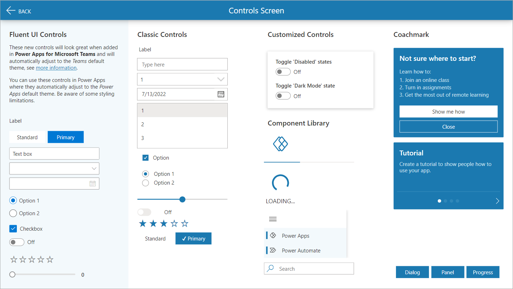
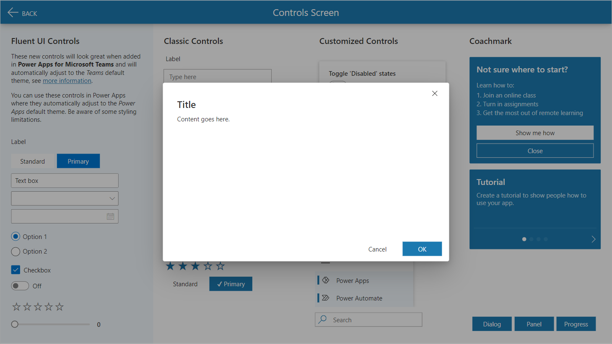
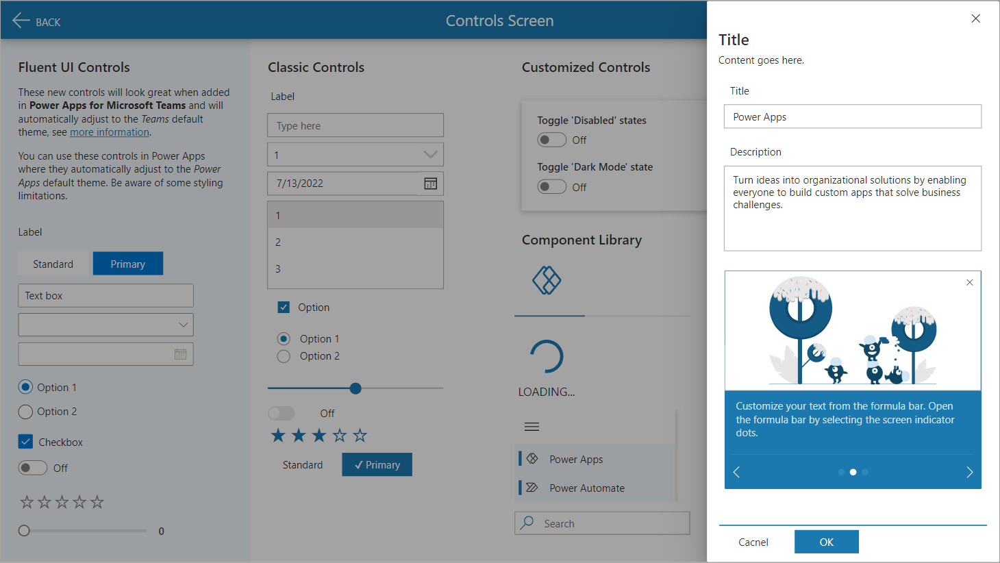
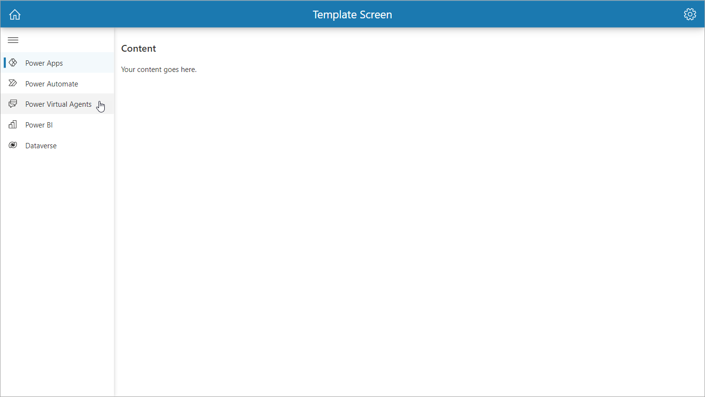
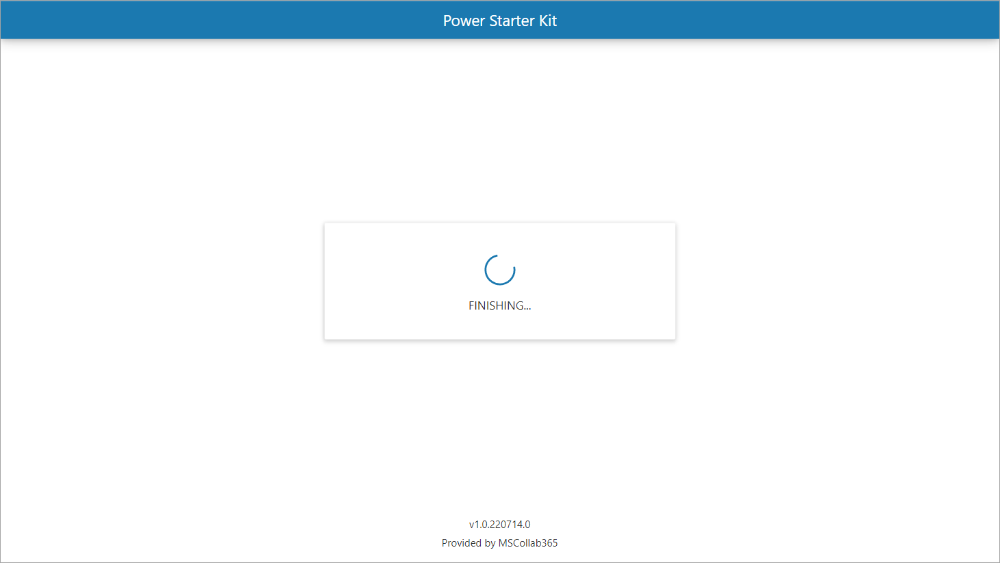

# Power Apps Starter Kit for Canvas Apps

Use this solution for rapid canvas (tablet) app development with a customizable theme design, component library with fly-out menu, dialog, panel, loader and much more.

> This template is inspired on [community samples](https://github.com/pnp/powerapps-samples) that demonstrate different usage patterns for Power Apps. I combined some of the samples with my own enhancements and created this app as a startup template for new projects.

## Preview

  

  

  

  

  

Current available themes:  

- [Theme light](./assets/theme-light.png)
- [Theme dark](./assets/theme-dark.png)

## Applies to

- [Microsoft Power Apps](https://docs.microsoft.com/powerapps/)
- [Component Library](https://docs.microsoft.com/en-us/power-apps/maker/canvas-apps/component-library)

## Compatibility


## Authors

| Solution Package | Author(s) |
| --- | --- |
| `msc365_PowerStarterKit_1_230109_0.zip` | [Martin Swinkels](https://github.com/msc365admin) |

## Version history

| Version | Date | Comments |
| --- | --- | --- |
| v1.230109.0-rc | January 9, 2023 | First release candidate |

## Features

This sample illustrates the following concepts:

- Customizable theme
- Pre-defined themed controls
- Pre-defined themed component library with:
  - Fly-out Menu
  - Pop-up Dialog
  - Pop-up Panel
  - Header w/ OnSelect behavior (.SVG icons)
  - Loading Spinner
  - Progress Bar
  - IconSVG w/ OnSelect behavior (.SVG)
  - SearchBox w/ OnSelect behavior
  - Coachmark
  - Coachmark Carousel
  - Coachmark Carousel w/ Illustrations
- Custom themed controls (HTML styles) with:
  - Shadow boxing
  - Gradient cards
  - Border radius
  - .SVG icons
- Themed UI Controls
- Fluent UI Controls
- Light and Dark mode
- Microsoft Teams theme `param` awareness

  ```text
    /* Set darkMode */
    Switch(
        Param("theme"),
        "dark",
        Set(
            darkMode,
            true
        ),
        Set(
            darkMode,
            false
        )
    );
  ```

- Set common styles for `borders`, `fonts`, `light` and `dark` mode

  ```text
    Set(
        themePalette,
        If(
            !darkMode,
            {
                themePrimary: "#1b79b0",
                themeLighterAlt: "#f3f9fc",
                themeLighter: "#d1e6f2",
                themeLight: "#acd2e7",
                themeTertiary: "#66a9d0",
                themeSecondary: "#2f87b9",
                themeDarkAlt: "#186d9e",
                themeDark: "#145c86",
                themeDarker: "#0f4463",
                neutralLighterAlt: "#faf9f8",
                neutralLighter: "#f3f2f1",
                neutralLight: "#edebe9",
                neutralQuaternaryAlt: "#e1dfdd",
                ...
            }
        )
    );
    Set(
        appTheme,
        {
            palette: themePalette,
            borders: {
                input: {
                    style: "Solid",
                    thickness: 1,
                    focusedThickness: 1,
                    radius: 0
                },
                button: {
                    style: "Solid",
                    thickness: 0,
                    focusedThickness: 0,
                    radius: 0
                }
            },
            fonts: {
                default: "'Segoe UI', 'Open Sans', sans-serif",
                size: {
                    xs: 9,
                    s: 10.5,
                    m: 12,
                    l: 16,
                    xl: 20
                },
                headings: {
                    h1: 24,
                    h2: 20,
                    h3: 14,
                    h4: 12
                }
            }
        }
    )
  ```

The color palette is based on Microsoft's [Fluent UI Theme Designer](https://www.aka.ms/themedesigner) and is fully customizable by acting on the variable called `appTheme.palette` which is initialized in the OnStart event of the App.

### Themed controls

`Button`, `Text Input`, `Pen Input`, `Dropdown`, `Combobox`, `Date Picker`, `Listbox`, `Checkbox`, `Radio`, `Toggle`, `Slider`, `Rating`, `Timer`, `Forms (Edit/View)`, `Rich Text Editor`, `Label`, `HTML Text`, `Forms Pro survey`, `Data Table`, `Gallery`, `Image`, `Camera`, `Barcode Scanner`, `Video`, `Microsoft Stream`, `Audio`, `Microphone`, `Add Picture`, `Import`, `Export`, `PDF Viewer`, `All Shapes`, `All Charts`.

All mentioned controls in the `theme.json` file are based on the `appTheme.palette` variable defined in the app.  

> **Note**: Removing or modifying (not maintaining the same structure) of `appTheme.palette` variable will generate function level errors.

## Prerequisites

- n/a

## Data Sources

- n/a

## Connectors

- n/a

## Minimal Path to Awesome

- [Download](./starterkit/package/msc365_PowerStarterKit_1_230109_0.zip) the `.zip` from the `starterkit/package` folder or the latest release.
- Within **[Power Apps Studio](https://make.powerapps.com/)**, import the `.zip` file using **Solutions** > **Import solution** > **Browse** and select the `.zip` file you just downloaded.

## Using the Source Code

You can also use the [Power Apps CLI](https://docs.microsoft.com/powerapps/developer/data-platform/powerapps-cli) to pack the source code by following these steps:

- Clone the repository to a local drive
- Pack the source files back into `.msapp` files:  

     ```bash
     pac canvas pack --sources path-to-source-folder --msapp path-to-msapp
     ```

     Making sure to replace `path-to-source-folder` to point to the path to this sample's `src` folder, and `path-to-msapp` to point to the path of this solution's `.msapp` file (located under the `package` folder).

     Repeat these steps for folders `msc365_PowerLibrary_src` and `msc365_PowerCanvasTemplate_src`.

- Pack the CanvasApps `.msapp` files into a solution `.zip` file:

     ```bash
     pac solution pack --zipfile fullpath-to-zip --folder path-to-solutionpackage
     ```

- Within **[Power Apps Studio](https://make.powerapps.com/)**, import the `.zip` file using **Solutions** > **Import solution** > **Browse** and select the `.zip` file you just packed.

## Disclaimer

**THIS CODE IS PROVIDED *AS IS* WITHOUT WARRANTY OF ANY KIND, EITHER EXPRESS OR IMPLIED, INCLUDING ANY IMPLIED WARRANTIES OF FITNESS FOR A PARTICULAR PURPOSE, MERCHANTABILITY, OR NON-INFRINGEMENT.**

## Help

I do not support shared samples, but I'm always willing to help, and I want to improve these shared samples. I use this repo to track issues, which makes it easy for members to volunteer their time and help resolve issues.

- If you encounter any issues while using this sample, you can [create a new issue](https://github.com/msc365/msc365.github.io/issues/new?assignees=msc365admin&labels=bug+suspected%2C+triage+required&template=bug_report.md&title=%5BBUG%5D+).
- If you have an idea for improvement, [make a suggestion](https://github.com/msc365/msc365.github.io/issues/new?assignees=msc365admin&labels=suggestion%2C+triage+required&template=feature_request.md&title=).

## For more information

- [Overview of creating apps in Power Apps](https://docs.microsoft.com/powerapps/maker/)
- [Power Apps canvas apps documentation](https://docs.microsoft.com/en-us/powerapps/maker/canvas-apps/)
